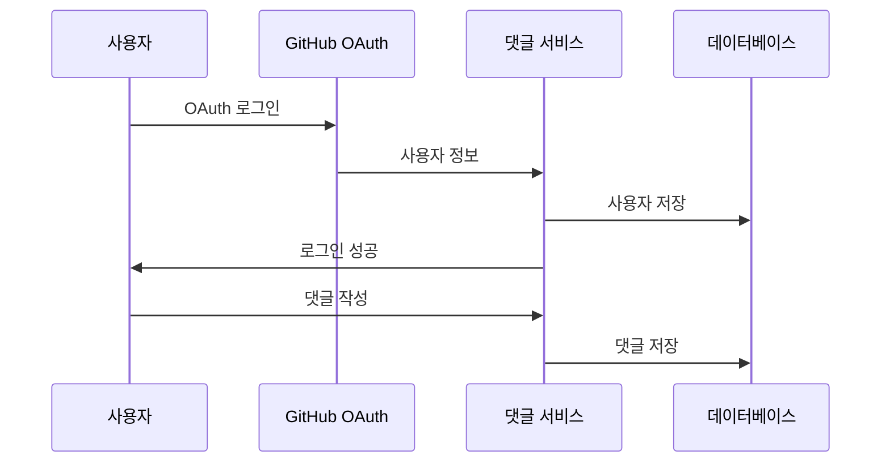
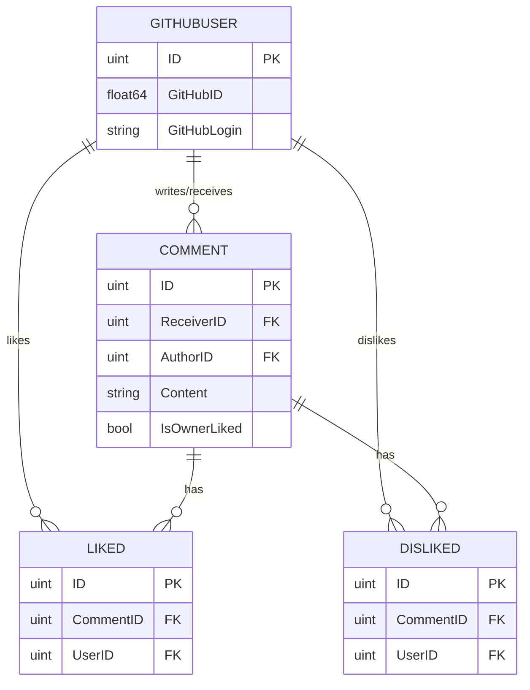

# GitHub Profile Comments

[](https://goreportcard.com/report/github.com/in-jun/github-profile-comments)

Interactive comment system for GitHub profile README. Adds dynamic communication functionality to GitHub profiles.

---

## 목차

-   [소개](#소개)
-   [기능](#기능)
-   [시작하기](#시작하기)
-   [테마](#테마)
-   [기술 스택](#기술-스택)
-   [아키텍처](#아키텍처)

---

## 소개

GitHub Profile Comments는 GitHub 프로필에 동적인 소통 기능을 추가하는 도구입니다.

### 작동 방식



## 기능

### 핵심 기능

-   실시간 댓글
-   좋아요/싫어요
-   커스텀 테마
-   GitHub OAuth 인증

### 사용자 기능

| 기능      | 설명                 | 권한        |
| --------- | -------------------- | ----------- |
| 댓글 작성 | 프로필에 댓글 남기기 | 로그인 필요 |
| 좋아요    | 댓글에 좋아요 표시   | 로그인 필요 |

## 시작하기

### 1. 회원가입

```bash
# 1. 인증 페이지 방문
https://github-comment.injun.dev/api/auth/login

# 2. GitHub OAuth 로그인 진행

# 3. 성공 응답 확인
{"github_id":123456789,"message":"Logged in successfully"}
```

### 2. 프로필 설정

```markdown
# README.md에 추가

[](https://github-comment.injun.dev/$깃허브아이디)
```

### 설치 확인

-   프로필 페이지 새로고침
-   댓글 위젯 표시 확인
-   테마 적용 확인

## 테마

### 사용 가능한 테마

| 테마        | 설명        | 예시                                                                                                                  |
| ----------- | ----------- | --------------------------------------------------------------------------------------------------------------------- |
| black       | 다크 모드   | [](https://github-comment.injun.dev/in-jun)       |
| white       | 라이트 모드 | [](https://github-comment.injun.dev/in-jun)       |
| transparent | 투명 배경   | [](https://github-comment.injun.dev/in-jun) |

## 기술 스택

### 프론트엔드

```yaml
UI:
    - HTML5
    - CSS3
    - JavaScript (ES6+)

기능:
    - 반응형 디자인
    - SVG 렌더링
```

### 백엔드

```yaml
서버:
    - Go
    - Gin Framework
    - GORM ORM

데이터베이스:
    - MySQL

인증:
    - GitHub OAuth
    - JWT
```

### 배포

```yaml
인프라:
    - Docker
    - injunweb (https://injunweb.com)
```

## 아키텍처

### 데이터베이스 구조


